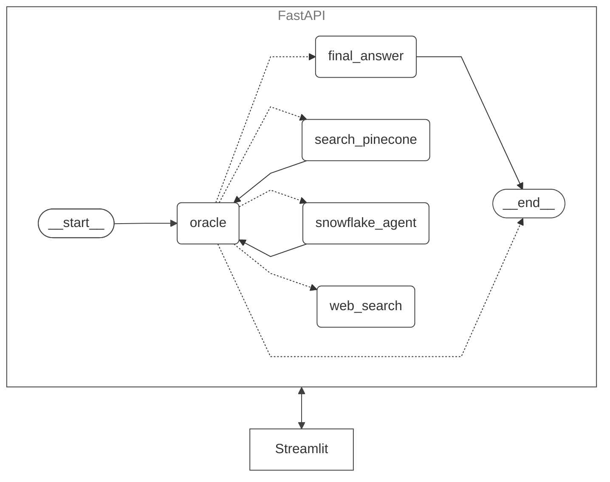

# Agentic Research

## Links

- [Google Codelabs](https://codelabs-preview.appspot.com/?file_id=16qMm5yUQzbz1FciKKSyXi8J2G2Up5jF7UyNY3O-FjUo#0)
- [Frontend (Streamlit)](https://nvidia-insight.streamlit.app)
- [Backend (FastAPI)](https://nevchris242-agentic-research.hf.space)
- [GitHub Tasks](https://github.com/orgs/DAMG7245-Team-2/projects/2)
- [Demo Video]()

## Architecture Diagram



## Project Overview

NVIDIA Insight is a comprehensive project designed to analyze NVIDIA's financial data using multiple agents. The problem statement revolves around understanding NVIDIA's financial metrics to make informed investment decisions. By leveraging Snowflake for valuation metrics storage, FastAPI for interacting with the LnagGraph backend, and Streamlit for frontend visualization, the project aims to provide insights into NVIDIA's financial metrics and facilitate research through automated agents. Snowflake allows efficient data management and retrieval, FastAPI provides robust backend services for handling API requests, and Streamlit offers an interactive frontend for data visualization and exploration.

## Step-by-Step Guide

1. Clone the Repository: Start by cloning the repository to your local machine. This will give you access to all the project files and directories.
2. Install Dependencies: Use pip to install all necessary dependencies for both backend and frontend. This ensures that all required packages are available for the project to run smoothly.
3. Run Backend: Launch the FastAPI backend to handle API requests. This step is crucial for enabling communication between the frontend and the data stored in Snowflake.
4. Run Frontend: Start the Streamlit frontend to interact with the application. This provides a user-friendly interface for exploring NVIDIA's financial data and insights generated by the agents.
5. Explore Features: Utilize the agents to analyze NVIDIA data and generate research documents. This step allows you to delve into the financial metrics and gain valuable insights.

## Directory Structure

```
agentic_research/
├── .gitattributes
├── .gitignore
├── Dockerfile
├── README.md
├── backend/
│   ├── api.py
│   ├── mygraph.py
│   ├── rag_pipeline.py
│   ├── requirements.txt
│   └── snowflake_agent/
│       ├── LLMManager.py
│       ├── load_data_snowflake.py
│       └── sql_agent.py
├── frontend/
│   ├── app.py
│   └── requirements.txt
├── graph.md
└── prototype/
├── fastapi_test.py
├── multi-agent-collaboration.ipynb
├── oracle_test.py
├── pinecone_rag_tool.py
├── requirements.txt
├── tavily_agent.py
├── tavily_test.py
└── visualization.ipynb
```

## Setup Instructions

1. Clone the repository:
   ```bash
   git clone <repository-url>
   ```
2. Navigate to the project directory:
   ```bash
   cd agentic-research
   ```
3. Install the backend dependencies:
   ```bash
   cd backend
   pip install -r requirements.txt
   ```
4. Install the frontend dependencies:
   ```bash
   cd frontend
   pip install -r requirements.txt
   ```
5. Copy the `.env.example` file to a new `.env` file and fill in the necessary environment variables with your specific credentials and API keys. This will configure your environment for the project.

```
SNOWFLAKE_USERNAME=
SNOWFLAKE_PASSWORD=
SNOWFLAKE_ACCOUNT=
SNOWFLAKE_DATABASE=
SNOWFLAKE_SCHEMA=
SNOWFLAKE_WAREHOUSE=
SNOWFLAKE_ROLE=
SNOWFLAKE_URI=

OPENAI_API_KEY=
GEMINI_API_KEY=
PINECONE_API_KEY=
TAVILY_API_KEY=

FASTAPI_URL=
```

6. Build the Docker image for the backend:
   ```bash
   docker build -t backend-image .
   ```
7. Run the Docker container:
   ```bash
   docker run -p 7860:7860 backend-image
   ```
8. Run the frontend application:
   ```bash
   streamlit run frontend/app.py
   ```

## Team Contribution

- Adwaith Korapati: 33%
- Ashish Nevan Gade: 33%
- Neha Devarapalli: 33%
