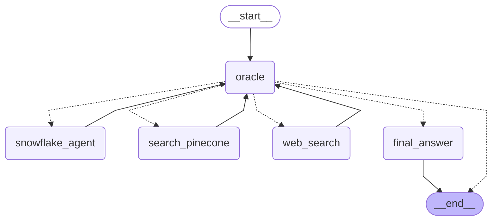

```mermaid
---
config:
  flowchart:
    curve: linear
---
graph TD;
	__start__([<p>__start__</p>]):::first
	oracle(oracle)
	snowflake_agent(snowflake_agent)
	search_pinecone(search_pinecone)
	web_search(web_search)
	final_answer(final_answer)
	__end__([<p>__end__</p>]):::last
	__start__ --> oracle;
	final_answer --> __end__;
	search_pinecone --> oracle;
	snowflake_agent --> oracle;
	web_search --> oracle;
	oracle -.-> snowflake_agent;
	oracle -.-> search_pinecone;
	oracle -.-> web_search;
	oracle -.-> final_answer;
	oracle -.-> __end__;
	classDef default fill:#f2f0ff,line-height:1.2
	classDef first fill-opacity:0
	classDef last fill:#bfb6fc
```
